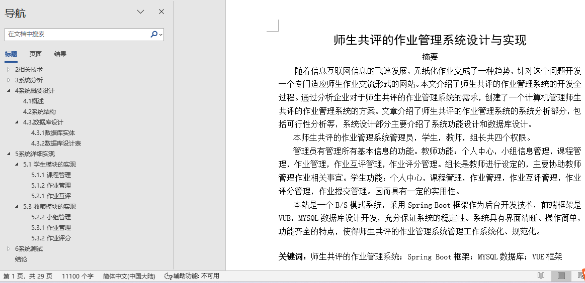
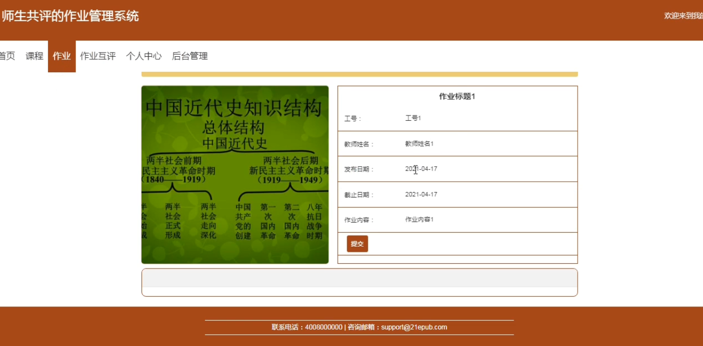
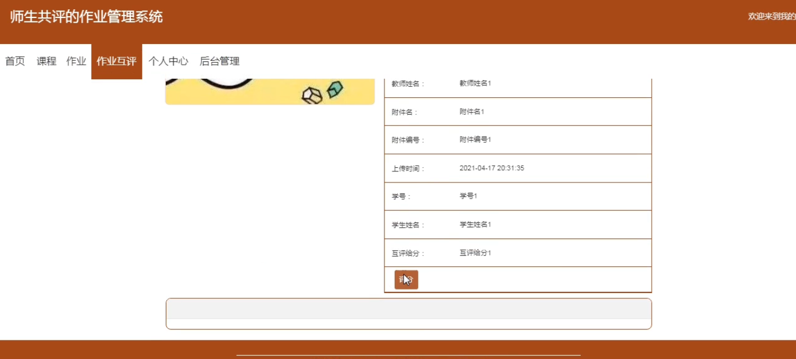
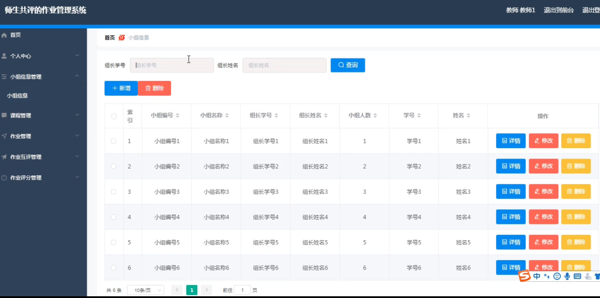
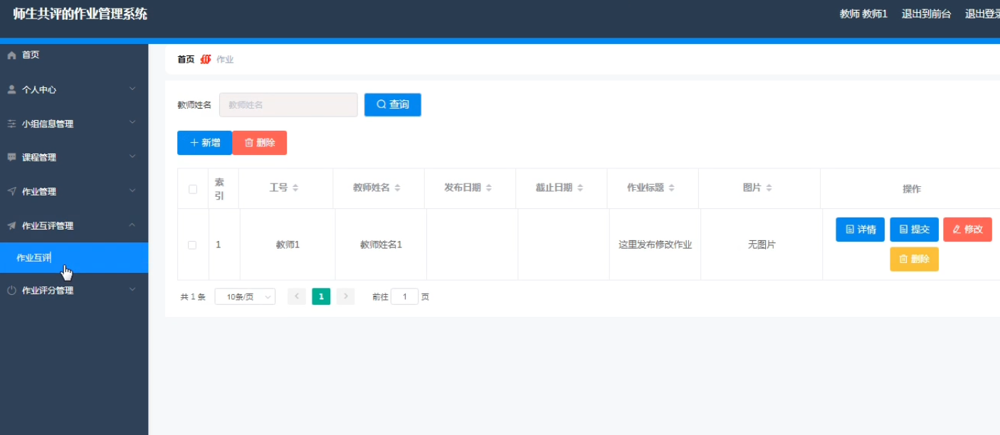
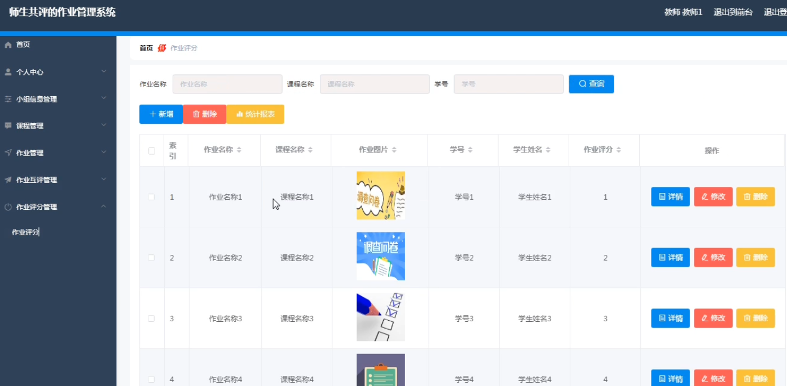
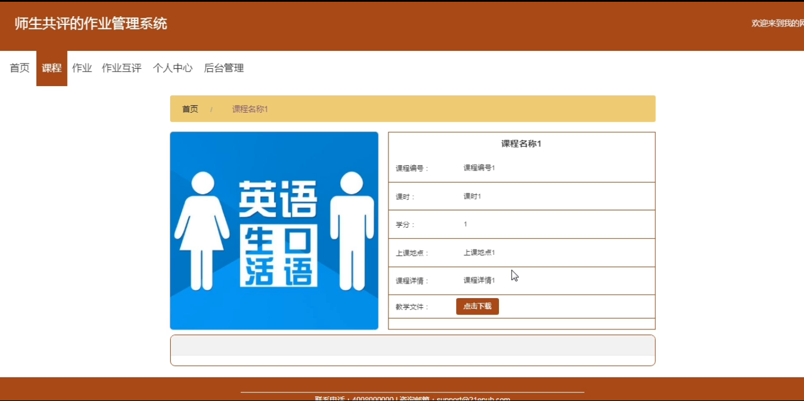

## 师生共评的作业管理系统(程序+报告)

###  获取sql数据库文件: 从戎源码网 (https://armycodes.com/) QQ: 386869957 QQ群: 377586148
###  所有系统地址: (https://github.com/YuLin-Coder/AllProjectCatalog) 
###  所有项目以及源代码本人均调试运行无问题 可支持远程安装部署调试、定制修改、代码讲解

## 项目介绍
师生共评的作业管理系统，系统包含两种角色：用户、管理员，系统分为前台和后台两大模块，主要功能如下：

1 学生模块的实现
- 课程管理: 学生可以在前台首页查看课程信息，并进行下载操作。
- 作业管理: 学生登录后可以在作业栏目查看并提交作业，提交操作需登录。
- 作业互评: 学生登录后可以查看他人的作业并进行评价。

2教师模块的实现
- 小组管理: 教师登录后可以管理小组信息，包括添加、修改和删除操作。
- 作业管理: 教师登录后可以对作业信息进行添加、修改和删除操作。
- 作业评分: 教师登录后可以对作业进行评分，包括添加、修改和删除操作。

## 项目技术
- 编程语言：Java
- 数据库：MySQL
- 项目管理工具：Maven
- 前端技术：HTML、CSS、JavaScript、Vue
- 后端技术：Spring、SpringMVC、MyBatis

## 运行环境
- JDK版本：JDK1.8及以上
- 开发工具：IDEA、Ecplise、Myecplise都可以
- 数据库: MySQL5.7及以上
- Maven：maven3.0及以上
- Node：14.14.0及以上

## 运行截图

